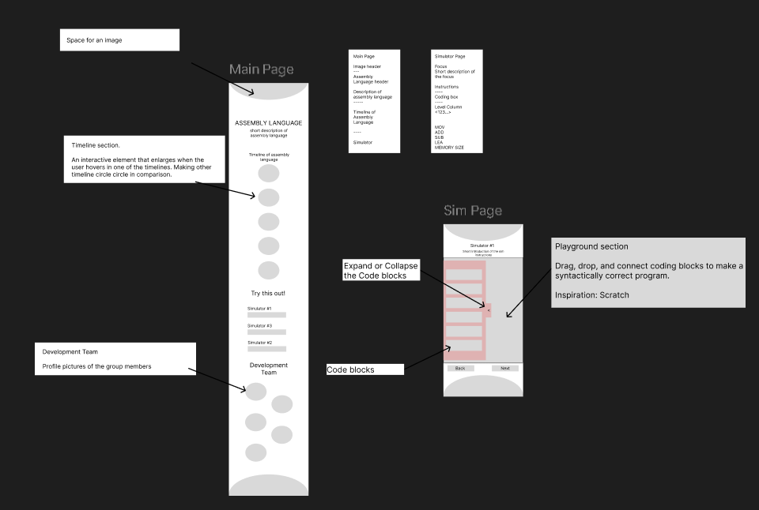

# CSARCH2_Group_7
# CSARCH2 Virtual Exhibit Case Proposal

# Title
“From 0s to 1s to Assembly: History of the x86-64 CISC Assembly Language”

## Member Roster
1. Bactong Gabrielle Joei Vasquez
2. Espineli Nyan Jezreel Gultiano
3. Gunita Catherine Rosswyn Dela Cruz
4. Magbatoc Ethan Daniel Berosa
5. Perez Jose Bryan Lee

---

## Topic Theme

**Theme: The History of the x86-64 NASM Assembly Language**

Assembly Language is a low-level language that allows programmers to communicate directly with computer hardware, offering more speed, space, and capability than most high-level languages. But before x86-64, ARM, MIPS–and the more popular assembly languages used today, computer scientists had to communicate directly with hardware using long strings of 0s and 1s. The history of assembly language can be traced back several decades, evolving from Alan Turing’s Enigma code machine in 1939, John Von Neumann’s stored-program concept in the 1940s, Maruice Wilkes EDSAC in 1949, and Grace Hopper’s symbolic programming concepts in 1952 to the well-known assembly languages we use today, assembly language has seen many breakthroughs and contributions to modern technology, one of them being the invention of x86-64 NASM assembly language (Alheraki, 2025).

Thus, our exhibit’s topic will focus on the history of one of the more popular assembly languages today, the x86-64 NASM assembly language. Our exhibit aims to inform the audience of the evolution of the x86-64 instruction set architecture (ISA), starting from key machines and their ISAs such as ENIAC, UNIVAC I, IBM 701, and CDC 6600, and how they all lead to the emergence of CISC and the invention of the x86-64 NASM AL. This will be done through an interactive presentation about the timeline leading up to the x86-64 NASM AL along with an interactive drag and drop simulation of how to program with an x86-64 NASM assembly language in SASM and how demonstrates 8-bit, 16-bit, 32-bit and 64-bit registers. Additionally, the UI theme would closely follow a professional site to immerse the audience.

**Key Machines and their ISAs**

**ENIAC (1945)**
The ENIAC, also known as the Electronic Numerical Integrator and Computer, is the first programmable computer created. It was built during World War II, mainly for calculating artillery values. Its known advantage was that once it was programmed, the machine ran at an electronic speed. However, the ENIAC was far from the ideal/universal computer used today. The machine needs to be rewired and configured for each new problem, which is time-consuming. 

**UNIVAC (1951)**
The UNIVAC, also known as the Universal Automatic Computer, is one of the earliest commercial data-processing computers. It was intended to replace punched-card accounting machines. It can read 7,200 decimal digits per second. It uses an operator keyboard and console typewriter for simple or limited input,  and magnetic tape for other inputs and outputs. The printed output produced was recorded on tapes and printed in a separate tape printer. 

**IBM 701 (1952)**
The IBM 701, also known as the defense calculator, was IBM's first production computer. It was built for scientific calculation and engineering computation for military and defence applications. It uses binary vacuum-tube logic computers with 36-bit words.  

**CDC 6600 (1964)**
During 1965-1977, CDC 6600 was considered the first supercomputer. It has the fastest clock speed of 100 nanoseconds, which is arguably very fast for its era. It is a general-purpose computer system, equipped with a distributed architecture. Utilizing a central scientific processor that is supported by 10 very fast peripheral processors, which handle the inputs and outputs. Its architecture only has 65 instructions.  

	
**How it all led to the x86-64 NASM Assembly Language**
	
By the late 1960s to early 1970s, software was becoming more complex while memory remained expensive. This forced hardware engineers to develop CISC with the ultimate goal of reducing the number of instructions a processor needed to execute for a task (Alheraki, 2025). Other goals were: 
1. Increase code density
2. Simplify programming
3. Reduce compiler workload
4. Improve productivity  

The development of CISC introduced Intel 8080, which would then introduce the x86-64 ISA, with the evolution of 64-bit registers.

**Evolution of Registers and their Processors**

Before the existence of the x86 family, early microprocessors such as the Intel 8080 (1974) or MOS Technology 6502 (1975) used 8-bit registers. These were named with single letters such as: A, B, H, or L. A few years later, Intel further advanced and created the Intel 8086 which now contained 16-bit registers. These registers now included two letters such as: AX, BX, DI, etc. Additionally, this microprocessor introduced the Instruction Set which allowed many computer operations.

With its evolution, naturally came the 32-bit registers as it extended the old 16-bit registers into 32-bit ones. This also translated into its register names by adding ‘E’ for ‘extended’ in the register names such as: EAX, ECX, etc that was led by Intel with the introduction of their Intel 80386 in 1985. The architecture became known as x64 due to its several Intel processors that carried the names ending in ‘86’ such as the aforementioned 8086 and 80386. 64-bit registers were introduced with AMD64, also known as, x86-64 in 2003 for larger memory addressing and faster processing. Its registers included: RAX, RBX, RCX, etc. Modern assemblers, such as NASM, support writing assembly code in both 32-bit x86 and 64-bit x86-64 systems.

---

## Tech Stack Plan
**The following are the intended interactive elements for the exhibit:** 

---

## Interactive Element

The first interactive element of our exhibit would be an **interactive timeline of the early key machines and their ISAs** such as the ENIAC, UNIVAC I, IBM 701, and CDC 6600, and how they all lead to the emergence of CISC and the invention of the x86-64 NASM AL. This will be done by visually presenting the audience with a timeline. In the timeline, the timeline dates would be presented as a “bubble”, and the audience would be able to click them to learn more information. 

**Fig 1. Concept draft of the interactive timeline of x86-64** 

The second interactive element of our exhibit would be an **interactive drag and drop simulation of coding with an x86-64 NASM assembly language.** This would be similar to the popular programming language and site “scratch” (See https://scratch.mit.edu/)

			
**Fig 2. Concept draft of the interactive drag and drop simulation of x86-64**

The simulator will allow the audience to simulate basic x86-64 SASM instructions such as MOV, ADD, and INC instructions demonstrating the use of the different registers (8-bit, 16-bit, 32-bit, 64-bit).

---

## Mobile-Responsive Layout (if possible)

**Fig 3. Concept draft of mobile layout**

---

## Style Guide Snapshot
The style guide consists of elements such as the **text styles and color palettes** to be used for the interactive element.

**Fig 4. Concept draft of the style guide**

**Fig 5. Concept style of layouts and design for the exhibit**

References:
Alheraki, A. (2025). The history of assembly language and CPU architectures. simplifycpp. https://simplifycpp.org/books/Assembly_Language_History.pdf  	
Evans, D. (n.d.). X86 assembly guide. Guide to x86 Assembly. https://www.cs.virginia.edu/~evans/cs216/guides/x86.html 

Introduction to x86 Assembly Programming. Adwaith’s Chronicles. (2018, August 12). https://www.agautham.io/rebeseries/2018/08/12/introduction-to-x86-assembly-programming.html 

