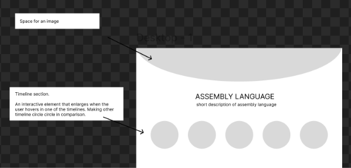
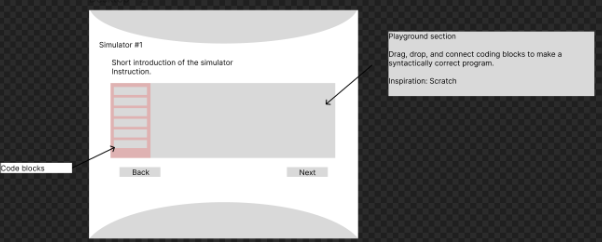
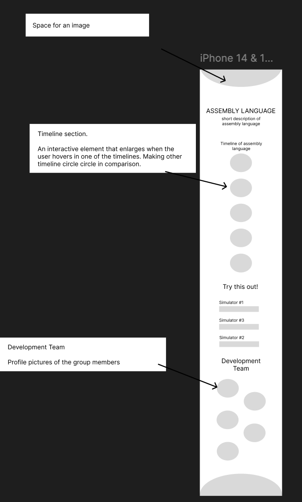
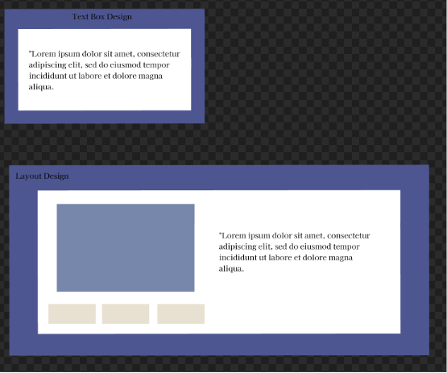

# CSARCH2_Group_7
# CSARCH2 Virtual Exhibit Case Proposal

# Title
“From 0s to 1s to Assembly: The History of  Programming and Assembly Language”

## Member Roster
1. Bactong Gabrielle Joei Vasquez
2. Espineli Nyan Jezreel Gultiano
3. Gunita Catherine Rosswyn Dela Cruz
4. Magbatoc Ethan Daniel Berosa
5. Perez Jose Bryan Lee

---

## Topic Theme
**History of Programming and Assembly Language**

Assembly Language is a low-level language that allows programmers to communicate directly with computer hardware, offering more speed, space, and capability than most high-level languages. But before x86-64, ARM, MIPS–and the more popular assembly languages used today, computer scientists had to communicate directly with hardware using long strings of 0s and 1s. The history of assembly language can be traced back several decades, evolving from Ada Lovelace’s first algorithm in 1843, Alan Turing’s Enigma code machine in 1939, and punched-card coding in the 20th century to the well-known assembly languages we use today, assembly language has seen many breakthroughs and contributions to modern technology.

Thus, our exhibit’s topic focuses on the history of programming and assembly language. Our exhibit aims to inform the audience of the predecessors of assembly languages and the evolution of computer systems that were used to decode and execute these instructions. This will be done through an interactive presentation about the timeline leading up to modern assembly languages along with an interactive drag and drop simulation of how to program with assembly language and how it now interacts with computer hardware. Additionally, the UI theme would closely follow a professional site to immerse the audience.

---

## Tech Stack Plan
**The following are the intended interactive elements for the exhibit:** 

The first interactive element of our exhibit would be an **interactive timeline of the first, second, third, fourth, and fifth generations of assembly languages.** This will be done by visually presenting the audience with a timeline. In the timeline, the timeline dates would be presented as a “bubble”, and the audience would be able to click them to learn more information. 

**Fig 1. Concept draft of the interactive timeline of assembly language** 

The second interactive element of our exhibit would be an interactive drag and drop simulation of coding with an x86-64 assembly language. This would be similar to the popular programming language and site “scratch” (See https://scratch.mit.edu/). 

			
**Fig 2. Concept draft of the interactive drag and drop simulation of x86-64**

The simulator will allow the audience to simulate basic x86-64 SASM instructions such as MOV, ADD, and INC instructions. This way, the audience who are not yet familiar with coding with assembly language get a feel of coding their first program even through a simulation. 

---

## Mobile-Responsive Layout (if possible)

**Fig 3. Concept draft of mobile layout**

---

## Style Guide Snapshot
The style guide consists of elements such as the text styles and color palettes to be used for the interactive element. Kindly note that this is only the initial design and the final product may differ.

**Fig 4. Concept draft of the style guide**

**Fig 5. Concept style of layouts and design for the exhibit**
